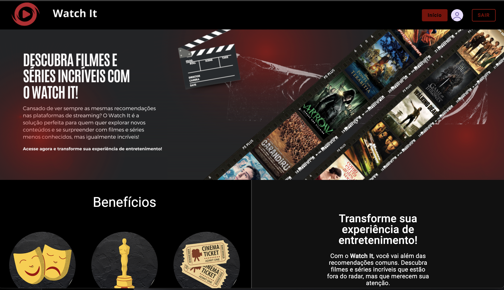
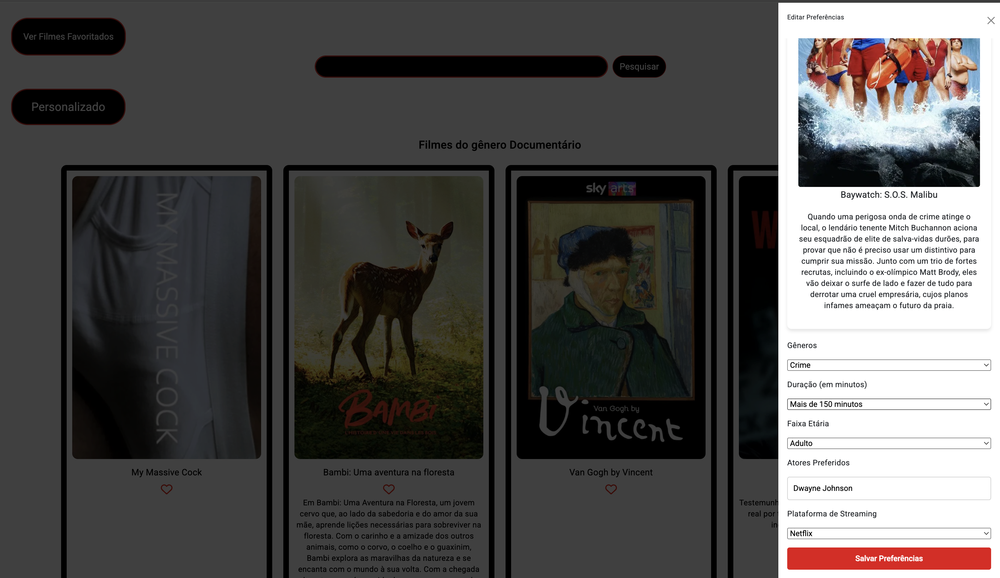

<h1 align="center">
 Projeto TCC - Watch It
</h1>

  <a href="#-tecnologias">Tecnologias</a>&nbsp;&nbsp;&nbsp;|&nbsp;&nbsp;&nbsp;
  <a href="#-projeto">Projeto</a>&nbsp;&nbsp;&nbsp;|&nbsp;&nbsp;&nbsp;

 

  

 

  
    
      

## 🚀 Tecnologias

Esse projeto foi desenvolvido com as seguintes tecnologias:

- HTML
- CSS
- JavaScript
- Git e GitHub
- TypeScript
- NodeJS
- MongoDB Atlas
- Bcrypt
- Angular
- Bootstrap

## 💻 Projeto

Esse é um projeto da qual eu realizei para apresentação do meu TCC na faculdade, muito feliz com o resultado final desse projeto.

Ele possui tela de Login, tela de cadastro, Menu do site, Menu dos filmes, aba para adicionar suas preferências entre outras abas para navegar dentro do site.

Feito com ♥ by Rafael Paiva :wave:
